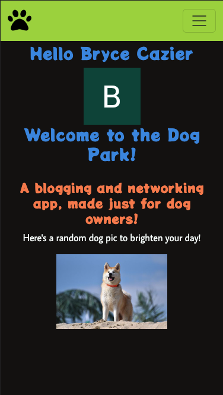

# The Dog Park Network

## Getting Started:
Join [here!](https://https://the-dog-park-network.fly.dev/)

### The Dog Park is a blogging and networking app, made just for dog owners! Users can post stories about their dogs and any cool tips and tricks they've learned, display info about the dogs they own, and connect with other users by adding them as friends! 

#### Adding Friends:
There are currently two ways that you can add friends:
##### Friend Code:
Every user is supplied a unique identifier friend code, which can be found in the Profile Menu, in the Friend Code tab. This is also the location to add other users by friend code. If you meet someone you'd like to add as a friend, just shoot them a text or have them write down the code to enter into the input field, and after clicking "Add Friend", you'll immediately be added to each other's friend contacts.

##### Send Friend Request:
Sometimes you'll find a user online that has a blog you really like, has dogs you'd like to meet, or are just interested in getting to know. In this case, just go to their profile and click on the "Add Friend" button. For security reasons, they will have to accept your friend request. After sending the request, a message will appear on their profile, notifying you that the request is pending. If they've accepted your request to be friends, this display will change to display their new status as a friend.

##### Checking Friend Requests:
To check if you've recieved any friend requests, log in and navigate to the Profile Menu. From here, click on the tab labelled "Friend Requests". This will render the page containing all users that have sent you a friend request. To view their profile, click on their name and you will be redirected to their profile page. To accept their request, simply click on the "Accept Request" button, and you will be added to each other's friend contacts.

## Technologies Used:

## Future Enhancements:
As a networking app, the main enhancement I'm currently working on is adding a the ability to chat with friends. I'm partway there! Other Ice Box items are listed below.

### Ice Box 🧊:
- [ ] Allow users to direct message friends
- [ ] Allow users to reject friend requests
- [ ] Allow users to block other users
- [ ] Enable a search bar to find content easily
- [ ] Allow users to add photos to their profile and blogs
- [ ] Light/Dark Mode toggle
- [ ] Allow users to hide profile info from users they aren't friends with
- [ ] Add more inputs for profile info
- [ ] Allow users to sort blog posts
- [ ] Allow users to change their profile picture
- [ ] Connect an API to allow users to find information on different dog breeds
- [ ] Add a section to allow users to set up play dates with other nearby dogs (warnings about meeting with strangers included)

## Planning Materials:
My planning materials can be found [here.](https://trello.com/b/qhzIpzBo/dog-app)

## Credits & Attributions:

Favicon was obtained from:

[icons8.com](https://icons8.com/icon/19821/dog-park)

Nav Icon:

[fontawesome.com](https://fontawesome.com/icons/paw?s=solid&f=classic)

